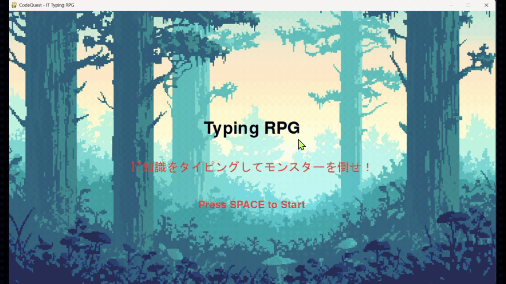

# Typing RPG - IT Typing RPG 🚀

IT知識を学びながらモンスターを倒す、RPG風タイピングゲームです！
キーボード入力の練習をしながら、コンピュータやインターネットの基本用語に詳しくなれます。

---

## 🎮 プレイ画面


---

## ✨ このゲームの特徴
- **IT用語が身につく！**: 「ビット」や「OS」といった基本から、「公開鍵暗号」や「アジャイル開発」といった少し難しい用語まで登場します。
- **RPG風のバトル**: モンスターが次々と出現！正しくタイピングして攻撃し、撃破しましょう。
- **かっこいい演出**: 攻撃時のフラッシュや、モンスターが倒れるエフェクトで爽快感バツグンです。
- **成績評価**: 最後にあなたの「正確さ」「スピード」「ランク」が表示されます。Sランクを目指そう！

---

## 🛠 遊ぶための準備

パソコンに **Python** がインストールされている必要があります。

1. **必要なライブラリを入れる**
   ターミナル（コマンドプロンプト）で以下のコマンドを入力してください：
   ```bash
   pip install pygame
   ```

2. **ゲームを始める**
   このフォルダで以下のコマンドを入力してください：
   ```bash
   python main.py
   ```

---

## ⌨️ 操作方法
- **スペースキー**: タイトル画面からゲームを始めたり、リザルト画面からタイトルに戻ったりします。
- **英字キー**: 画面に表示されるローマ字をタイピングします。

---

## 📚 開発者の方へ
このゲームのプログラム構造や、詳しい技術的な仕組みについては、以下のドキュメントをご覧ください。

- [**ソースコードの解説 (src/README.md)**](src/README.md)

---

## 🎁 お借りした素材
このゲームでは、以下の素晴らしいフリー素材を使用させていただいています。ありがとうございます！

- **フォント**: [Rounded Mplus](http://jikasei.me/font/rounded-mplus/)（自家製フォント工房様）
- **モンスター・背景画像**: [Game Materials](https://game-materials.com/2d-matome/)（ぴぽや倉庫様 / 他）
- **音楽・効果音**: [魔王魂](https://maou.audio/)様

---

Developed with ❤️ for IT learners.
